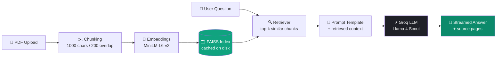

<div align="center">

# 🧠 DocMind

### Chat with any PDF — instantly, intelligently, beautifully.

A ChatGPT-style RAG (Retrieval Augmented Generation) chat app that lets you upload a PDF and have a real conversation with it, powered by **Groq's Llama 4 Scout**, **FAISS**, and **Streamlit**.


</div>

---

## 📑 Table of Contents

- [Overview](#-overview)
- [Features](#-features)
- [Preview](#️-preview)
- [Architecture](#️-architecture)
- [Tech Stack](#-tech-stack)
- [Project Structure](#-project-structure)
- [Getting Started](#-getting-started)
- [Configuration](#️-configuration)
- [How It Works](#-how-it-works)
- [Usage Guide](#-usage-guide)
- [Troubleshooting / FAQ](#-troubleshooting--faq)
- [Roadmap](#️-roadmap)
- [Contributing](#-contributing)
- [License](#-license)
- [Acknowledgments](#-acknowledgments)

---

## 🔍 Overview

**DocMind** turns any PDF into an interactive conversation. Upload a document, and ask it questions in plain English — DocMind retrieves the most relevant passages and gets Groq's blazing-fast Llama 4 Scout model to answer **strictly from your document's content**, with full source transparency (you always see which page an answer came from).

No more `Ctrl+F`. No more skimming 40 pages for one paragraph.

---

## ✨ Features

| | Feature | Description |
|---|---|---|
| 💬 | **ChatGPT-style chat UI** | Dark theme, message bubbles, smooth fade-in animations |
| ⚡ | **Real-time streaming** | Answers stream token-by-token with a live typing indicator |
| 🧠 | **Grounded answers** | The model only answers from retrieved document context — no hallucination-friendly prompting |
| 📄 | **Source transparency** | Every answer comes with an expandable "View sources" panel showing the exact page & excerpt used |
| 🗂️ | **Smart caching** | Each PDF is hashed — re-uploading the same file skips re-embedding entirely |
| ⚙️ | **Live tunable settings** | Adjust retrieval depth (`k`) and response creativity (`temperature`) on the fly |
| ✨ | **Suggested prompts** | One-click example questions when starting a new chat |
| 🔄 | **Force re-index** | Rebuild the vector index anytime if the PDF content changes |
| 🧹 | **Clean session control** | Clear chat with one click without losing your indexed document |

---

## 🖼️ Preview

> 💡 Add a real screenshot or GIF of the app here, e.g. `docs/demo.gif`, and embed it with:
> ``

A rough idea of the chat experience:

```
┌──────────────────────────────────────────────────────┐
│                        🧠 DocMind                     │
│         Ask anything. Get answers from your PDF.      │
├────────────────────────────────────────────────────────┤
│                                                         │
│                                    🧑‍💻  You ╮          │
│                          ╭─────────────────────────╮   │
│                          │ Summarize this document │   │
│                          ╰─────────────────────────╯   │
│                                                         │
│  🤖  DocMind                                           │
│  ╭───────────────────────────────────────────────╮     │
│  │ The document outlines three key findings...   │     │
│  ╰───────────────────────────────────────────────╯     │
│  📄 View sources ▾  (page 4, page 7)                  │
│                                                         │
│  ┌───────────────────────────────────────────────┐    │
│  │  Message DocMind…                          ➤  │    │
│  └───────────────────────────────────────────────┘    │
└──────────────────────────────────────────────────────┘
```

---

## 🏗️ Architecture



**Flow in plain words:**
1. You upload a PDF → it's split into overlapping chunks.
2. Each chunk is converted into a vector embedding and stored in a FAISS index (cached by file hash).
3. When you ask a question, the same embedding model encodes your question and FAISS returns the top-k most relevant chunks.
4. Those chunks + your question are fed into a prompt template.
5. Groq's Llama 4 Scout generates an answer **grounded only in that context**, streamed back token-by-token.

---

## 🧰 Tech Stack

| Layer | Technology |
|---|---|
| UI / Frontend | [Streamlit](https://streamlit.io) (custom CSS theme) |
| Orchestration | [LangChain](https://www.langchain.com/) (LCEL chains) |
| LLM Inference | [Groq](https://groq.com/) — `llama-4-scout-17b-16e-instruct` |
| Embeddings | [Sentence-Transformers](https://www.sbert.net/) — `all-MiniLM-L6-v2` |
| Vector Store | [FAISS](https://github.com/facebookresearch/faiss) (local, disk-cached) |
| PDF Parsing | [pypdf](https://pypdf.readthedocs.io/) via `PyPDFLoader` |
| Config | `python-dotenv` |

---

## 📁 Project Structure

```
docmind/
├── app.py                # Streamlit front-end (UI, chat loop, streaming, sidebar)
├── rag_backend.py        # RAG engine (loading, chunking, FAISS, Groq chain)
├── requirements.txt      # Python dependencies
├── .env.example           # Template for required environment variables
├── .env                   # Your actual secrets (create this — gitignored)
├── uploaded_pdfs/         # Auto-created — stores uploaded PDFs
└── faiss_db/              # Auto-created — cached FAISS indexes per document
```

---

## 🚀 Getting Started

### 1. Clone / download the project
Place `app.py`, `rag_backend.py`, and `requirements.txt` in the same folder.

### 2. Create a virtual environment (recommended)

```bash
python -m venv venv
venv\Scripts\activate        # Windows
source venv/bin/activate     # macOS / Linux
```

### 3. Install dependencies

```bash
pip install -r requirements.txt
```

### 4. Set up your API key

Copy `.env.example` to `.env` and add your [Groq API key](https://console.groq.com/keys):

```bash
GROQ_API_KEY=your_groq_api_key_here
```

### 5. Run the app

```bash
streamlit run app.py
```

The app opens automatically at **http://localhost:8501** 🎉

---

## ⚙️ Configuration

These are adjustable live from the **⚙️ Settings** panel in the sidebar:

| Setting | Range | Default | Effect |
|---|---|---|---|
| `k` (context chunks) | 1 – 8 | 3 | More chunks = more context, but noisier/slower answers |
| `temperature` | 0.0 – 1.0 | 0.2 | Higher = more creative/varied phrasing, lower = more deterministic |

These are set in `rag_backend.py` and apply at indexing time:

| Constant | Default | Purpose |
|---|---|---|
| `CHUNK_SIZE` | 1000 | Characters per chunk |
| `CHUNK_OVERLAP` | 200 | Overlap between consecutive chunks (preserves context across boundaries) |
| `EMBEDDING_MODEL` | `all-MiniLM-L6-v2` | Sentence embedding model |
| `GROQ_MODEL` | `llama-4-scout-17b-16e-instruct` | LLM used for answer generation |

---

## 🧠 How It Works

- **Chunking** — `RecursiveCharacterTextSplitter` breaks the PDF into ~1000-character pieces with 200-character overlap, preserving sentence/paragraph boundaries where possible.
- **Embedding & Indexing** — Each chunk is embedded using a local MiniLM sentence-transformer and stored in a FAISS vector index.
- **Disk caching** — The index is saved under `faiss_db/<filename>_<content-hash>/`. If you re-upload the exact same file, DocMind loads the cached index instantly instead of re-embedding.
- **Retrieval** — On every question, FAISS performs a similarity search and returns the top-`k` most relevant chunks.
- **Grounded generation** — A strict prompt template instructs the LLM to answer *only* from the retrieved context, and to explicitly say when the document doesn't contain the answer (reducing hallucinations).
- **Streaming** — The LangChain chain is invoked with `.stream()`, so tokens are rendered live in the UI with a blinking cursor, just like ChatGPT.

---

## 💬 Usage Guide

1. **Upload** a PDF from the sidebar.
2. Click **⚡ Process** — DocMind reads, chunks, and indexes it (or loads it instantly from cache).
3. Use a **suggested prompt** or type your own question in the chat box.
4. Watch the answer **stream in live**.
5. Expand **📄 View sources** under any answer to see exactly which page(s) it came from.
6. Tweak **k** / **temperature** in Settings to control answer depth and tone.
7. Hit **🔄 Re-index** if you've edited the source PDF, or **🗑️ Clear chat** to start a fresh conversation on the same document.

---

## 🐛 Troubleshooting / FAQ

<details>
<summary><b>"GROQ_API_KEY not found" error</b></summary>

Make sure a `.env` file (not `.env.example`) exists in the project root with a valid key from the [Groq Console](https://console.groq.com/keys), then restart the app.
</details>

<details>
<summary><b>First "Process" click feels slow</b></summary>

The first run downloads the MiniLM embedding model (a few hundred MB) from Hugging Face. Subsequent runs are much faster, and re-uploading the same PDF skips re-embedding entirely thanks to caching.
</details>

<details>
<summary><b>"Couldn't extract any text from this PDF"</b></summary>

This usually means the PDF is scanned/image-only with no embedded text layer. Run it through an OCR tool first, then re-upload.
</details>

<details>
<summary><b>Answers feel too short / too long</b></summary>

Increase `k` in Settings for more context, or tweak the prompt template in `rag_backend.py` to request longer/shorter answers.
</details>

---

## 🗺️ Roadmap

- [ ] Multi-document chat (query across several PDFs at once)
- [ ] Persistent chat history across sessions (SQLite/JSON)
- [ ] Multi-turn conversational memory (follow-up question awareness)
- [ ] Inline highlighting of the exact sentence used as a source
- [ ] Support for `.docx` / `.txt` / `.url` inputs
- [ ] Export chat as PDF/Markdown transcript

---

## 🤝 Contributing

Contributions, ideas, and bug reports are welcome — feel free to fork the project and open a PR, or open an issue describing the change you'd like to see.

---

## 📜 License

This project is licensed under the **MIT License** — free to use, modify, and distribute.

---

## 🙏 Acknowledgments

- [Groq](https://groq.com/) for ultra-fast LLM inference
- [LangChain](https://www.langchain.com/) for RAG orchestration
- [FAISS](https://github.com/facebookresearch/faiss) by Meta AI for vector search
- [Sentence-Transformers](https://www.sbert.net/) for embeddings
- [Streamlit](https://streamlit.io) for making beautiful Python UIs effortless

<div align="center">

Made with ❤️ and a lot of ☕ — **DocMind**

</div>
